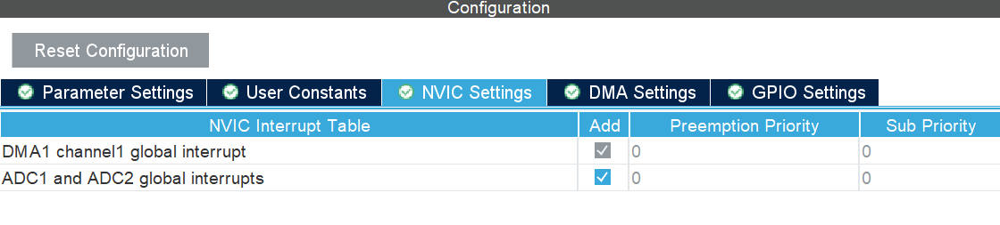
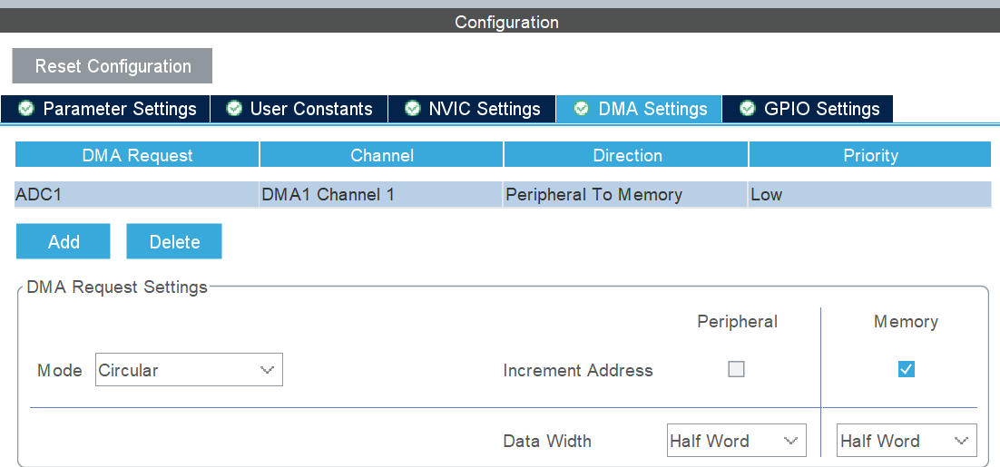
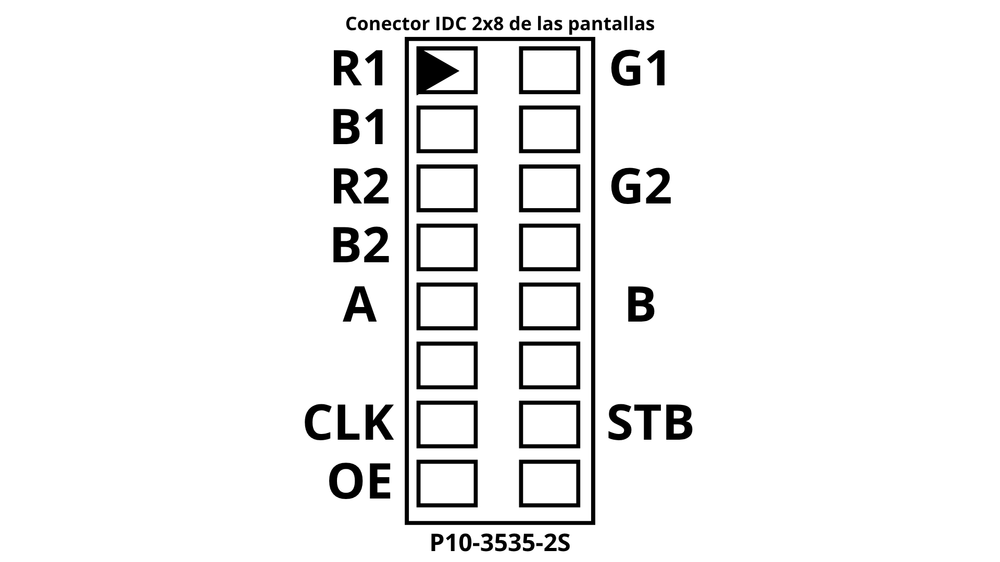
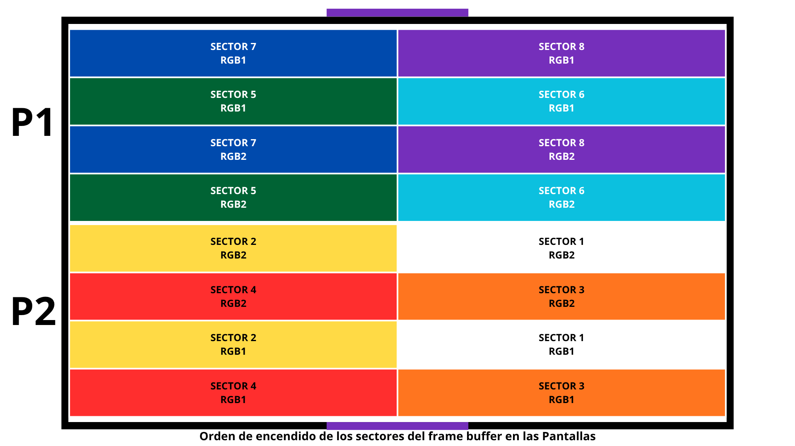

# tdse-tpf_2_09v2
# Documentación General del Proyecto
## UBA en Acción: Juego RGB
### PROYECTO FINAL DE TALLER DE SISTEMAS EMBEBIDOS (TA123)
#### Dispositivo Interactivo Modular con Display RGB

En este archivo se encuentra la documentación central del Trabajo Integrador Final de Taller de Sistemas Embebidos del grupo 9 del curso 2 (1er Cuatrimestre del 2025) realizado para utilizarse en el stand de UBA en Acción de la Facultad de Ingeniería de la Universidad de Buenos Aires (UBA) con el objetivo de proveer un espacio lúdico dentro de la propuesta de UBa en Acción donde se motiven las vocaciones científico-tecnlógicas (STEM). Para este Trabajo Práctico Integrador se utilizó una ST NÚCLEO F103RB.

---

## Índice

1. [Sección 1: Visión General del Proyecto](#1-sección-1-visión-general-del-proyecto)
2. [Sección 2: Hardware del proyecto](#2-sección-2-hardware-del-proyecto)
3. [Sección 3: Configuración del IOC](#3-sección-3-configuración-del-ioc)
4. [Sección 4: Documentación de las pantallas (frame buffer y HUB75)](#4-sección-4-documentación-de-las-pantallas-frame-buffer-y-hub75)
5. [Sección 5: Documentación de la matriz](#5-sección-5-documentación-de-la-matriz)
6. [Sección 6: Documentación de los módulos I2C](#6-sección-6-documentación-de-los-módulos-i2c)
7. [Sección 7: Documentación de los estados](#7-sección-7-documentación-de-los-estados)
8. [Sección 8: Documentación de los botones](#8-sección-8-documentación-de-los-botones)
9. [Sección 9: Documentación del Menú](#9-sección-9-documentación-del-menú)
10. [Sección 10: Documentación de los potenciómetros](#10-sección-10-documentación-de-los-potenciómetros)
11. [Sección 11: Documentación de los cálculos de tiempos de ejecución](#11-sección-11-documentación-de-los-cálculos-de-tiempos-de-ejecución)

---

## 1. Sección 1: Visión General del Proyecto

* **Responsables:** 
    * BARRIONUEVO, JUAN BAUTISTA - 109086 - <jbbarrionuevo@fi.uba.ar>
    * GABAY, Cloe - 109788 - <cgabay@fi.uba.ar>
    * GAMBERALE, María de las Mercedes - 108834 - <mgamberale@fi.uba.ar>
    * LEON, Martín Fernando	- 109138 - <mfleon@fi.uba.ar>
* **Estado:** En revisión

### Descripción

El proyecto consiste en un sistema con pantallas RGB de 32x32 pixeles de modo de controlar por medio de botones y potenciómetros lo mostrado en la misma. Se diseñan dos modos de juego, secuencia (un juego de recordar e imitar una secuencia mostrada) y PixelArt (un juego para ir dibujando en la pantalla variando el color de lo mostrado con potenciómetros). Para navegar por los distintos modos y tener opciones en los mismos se utiliza un menú, mostrado en un Display I2C. Se agrega una memoria para almacenar pixelArts guardados y poder guardar nuevos. 

[Volver al Índice](#índice)

---

## 2. Sección 2: Hardware del proyecto

* **Responsables:** [María de las Mercedes Gamberale (mgalcuadrado)]
* **Estado:** Completado 

### Detalle del Hardware

Los materiales utilizados fueron los siguientes:
|Productos                                         | Precio (ARS)        | Sitio del producto |
|--------------------------------------------------|---------------------|--------------------|
| Microcontrolador (NUCLEO-F103RB) (x1)            | 15.000              | 
| Módulo Pantalla Led P10 RGB 16x32cm (x2)         | 53.000              | mercadolibre.com.ar|
| Pulsadores tipo arcade (x6)                      | 2.000               | mercadolibre.com.ar|
| Fuente switching 5V 20A                   | 29.000               | mercadolibre.com.ar|
| Módulo display 20x04 (x1)                        | 15.000              | nubbeo.com.ar      |
| Módulo I2C para display (x1)                     | 3.200               | nubbeo.com.ar      |
| Módulo Memoria I2C (x1)                          | 1.999               | nubbeo.com.ar      |
| Buffers 74HCT245 (x4)                            | 6.000               | mercadolibre.com.ar|
| Bornera B2P (x7)                                              | 3.884              | microelectronicash.com
| Placa de cobre simple faz 10x15                                              | 9.501              | microelectronicash.com
| Tira de Pines hembra doble 2.54mm                                              | 14.000              | microelectronicash.com
|Potenciometros 10k (x3)                                            | 5.000              | microelectronicash.com
| Zocalos 2x10 (x2)                                            | 563             | microelectronicash.com
| Capacitor electrolitico 100uF  (x2)                                            | 410             | microelectronicash.com
| 

### Nota importante sobre las pantallas obtenidas
Las pantallas a comprar requerían ser accesibles en precio, relativamente económicas y aptas para exteriores dado que los stands de UBA en Acción se realizan de día y al aire libre. El mejor trade-off entre estas características se encontró en las pantallas P10-3535-2S; sin embargo, la documentación de las mismas resultó ser escasa por lo que su funcionamiento adecuado fue analizado por inspección, prueba e investigación de variantes de los protocolos usuales de pantallas de esta índole. Esto se discutirá en detalle en [la documentación de las pantallas](#4-sección-4-documentación-de-las-pantallas-frame-buffer-y-hub75).

Se utilizaron dos pantallas RGB de 16x32 píxeles conectadas en cascada (_daisy chain_) y colocadas con la siguiente distribución:


Se destaca que las pantallas están invertidas una respecto a la otra ya que el cable de conexionado proveído por el fabricante no era lo suficientemente largo como para colocarlas con la misma orientación y, en lugar de rehacer el cable con un largo mayor, simplemente se rotó una de las pantallas para que los conectoeres de salida de la pantalla 1 y de entrada de la pantalla 2 quedaran alineados; esto se corrigió con relativa facilidad por software, no agregando complejidad mayor al problema en cuestión.  

### Justificación de inclusión de los buffers SN74HCT245 y su conexionado

### Justificación del uso de fuente switching - cálculos de consumo estimados

### Alimentación de la ST
Se trabajó en la alimentación independiente de la ST. Para esto resulta muy importante conocer lo siguiente:
1. Para alimentar externamente como se hace en este trabajo se debe mover el jumper JP5 del modo de alimentación por UART (U5V) al modo de alimentación externa (E5V). 
2. Se conecta luego a GND y a E5V.

### Esquemáticos y PCB

Para poder probar la alimentación de la ST con la fuente de 5V 4A se realizó, en una primera versión con el objetivo de probar las pantallas LED y la alimentación de la ST Núcleo, el siguiente PCB:
Nótese que el LD1 cuando se está trabajando con alimentación externa se prenderá y apagará intermitentemente. Esto es adecuado para la utilización de alimentación externa ya que es indicadora de que no se detecta comunicación por UART.


La primera placa se diseñó en EasyEDA el 16 de julio del 2026 y [el proyecto se puede visualizar en este enlace]( https://oshwlab.com/mgamberale/project_ptvksycq). 

Con esta placa, al ver que esta no funcionaba como era debido, se resolvió agregar los transceptores SN74HCT245 para que las señales recibidas en la pantalla tuviesen un nivel lógico de 5V (como es debido) en lugar de los 3V3 de los pines de salida de la ST NÚCLEO F103RB. 

Se realizó, luego de haberse probado su adecuado funcionameinto en protoboard, una segunda versión del circuito impreso, ya incluyendo la ST completa, los buffers, el conector para el IDC, pines para conectar el Display la Memoria, y las borneras para botones y potenciómetros. El diseño y la placa resultante se pueden ver a continuación, estando también [el proyecto disponible para su visualización en EasyEDA]( https://oshwlab.com/mgamberale/project_rwfgvxck): 


Esta placa propuso sendos inconvenientes, siendo los más destacados: 
- Al descargar esta placa se movió la pista del clock (CLK) hacia arriba accidentalmente, generándoseun cortocircuito entre el output enable (OE), latch (LAT) que no se descurió hasta luego de soldar toda la placa. Se cortaron algunas pistas y se realizaron puentes por la capa inferior, pero estos produjeron cortos accidentales en sendas ocasiones. 
- Las borneras de 3 pines para los potenciómetros se agregaron co la huella incorrecta; teniendo estas una separación de 3.5mm en lugar de las de 5mm vendidas comercialmente. Se soldaron para pruebas los cables directamente a la placa, lo que provocó cortocircuitos y falsos contactos. 
- Sendos puentes eran evitables. 
- Los puentes se hicieron con cable multifilar, así que algunos producían cortos o falsos contactos. 
- La separación entre pistas tenía una separación mínima de 0.3mm, por lo cual algunas pistas tenían cortos. La clearance del plano de masa estaba en 0.6mm, lo que también causó sendos problemas. 
- Por una facilidad de ruteo se había movido el pin del clock del PB13 al PA10. Esto resultó contraproducente por restricciones de la ST, así que se regresó al pin PB13. 

Se realizó entonces una tercera versión final de la placa, corrigiendo estos errores e inconvenientes. Esta se encuentra también dentro del mismo proyecto de EasyEDA que la anterior dada la baja cantidad de cambios al esquemático (únicamente el descripto en el ítem anterior). 

El diseño y la placa resultante se pueden ver a continuación, estando también [el proyecto disponible para su visualización en EasyEDA]( https://oshwlab.com/mgamberale/project_rwfgvxck): 


[Volver al Índice](#índice)

---

## 3. Sección 3: Configuración del IOC

* **Responsables:** Equipo.

### Configuración de Periféricos y Pines
Explicación de la configuración del IOC (STM32CubeMX), asignación de pines y periféricos (GPIO, etc.).

Los pines utilizados en el ioc son los siguientes (DEBEN TENER LA ETIQUETA DESIGNADA):

```I2C ```

En pinout Configurations a la izquierda, ir a Connectivity > I2C1 > Mode I2C > 
```
I2C1(SCL) | PB6
I2C1(SCA) | PB7
```

```HUB75 ```
Configurar como GPIO_Output con Maximum Output Speed HIGH y en GPIO Output Level LOW, a excepción del OE cuyo Output Level es HIGH. 
```
R1   | PC9
G1   | PC10
BL1  | PC8 
R2   | PC6
G2   | PC7
B2   | PC11

A    | PB10
CLK  |  PB13
LAT  | PA6
OE   | PA9
```

```BOTONES ```

Configurar como GPIO_Input y, particularmente, con GPIO Pull-up.

```
BU1 | PC0
BU2 | PC1
BU3 | PC2
BU4 | PC3
BU5 | PC4
BU6 | PC5

```

```POTENCIÓMETROS ```

Se configura el modo *Analog* del IOC. Se utiliza el ADC1, en particular los canales ```IN0```, ```IN1``` e ```IN4``` del ```ADC1```. 

En *Parameter Settings* se:
- aumenta el number of conversions a 3
- modifican los Ranks de modo que en el Rank 1 se escuche el Channel 0, Rank 2 al Chanmel 1 y Rank 3 al Channel 4; y el sampling rate se fijó en 239.5 Cycles para los tres canales.
- Scan Conversion Mode y Continuous Conversion Mode Enabled

En *NVIC Settings* se añaden las global interrupts del DMA1 y del ADC1 como se muestra a continuación:



En *DMA Settings* se añade a las DMA Requests el ADC1 con modo Circular con la data width en Peripheral y Memory como Half Word. Se agrega el Increment Address de la memoria. 



### Clock Configuration

En la Clock Configuration se debe cambiar lo siguiente:

* PLL Source Mux en HSI 
* PLLMUX en x16
* ADC Prescaler en /6 

Adicionalmente, verificar lo marcado en verde  en la imagen a continuación. Se indican tambien las casillas a modificar, en violeta, para hallarlas con facilidad. 


[Volver al Índice](#índice)

---

## 4. Sección 4: Documentación de las pantallas (frame buffer y HUB75)

* **Responsables:** [Maria de las Mercedes Gamberale (mgalcuadrado)]


### Nota importante sobre las pantallas obtenidas
Las pantallas a comprar requerían ser accesibles en precio, relativamente económicas y aptas para exteriores dado que los stands de UBA en Acción se realizan de día y al aire libre. El mejor trade-off entre estas características se encontró en las pantallas P10-3535-2S; sin embargo, la documentación de las mismas resultó ser escasa por lo que su funcionamiento adecuado fue analizado por inspección, prueba e investigación de variantes de los protocolos usuales de pantallas de esta índole. Esto se discutirá en detalle en [la documentación de las pantallas](#4-sección-4-documentación-de-las-pantallas-frame-buffer-y-hub75).

Se utilizaron dos pantallas RGB de 16x32 píxeles conectadas en cascada (_daisy chain_) y colocadas con la siguiente distribución:


Se destaca que las pantallas están invertidas una respecto a la otra ya que el cable de conexionado proveído por el fabricante no era lo suficientemente largo como para colocarlas con la misma orientación y, en lugar de rehacer el cable con un largo mayor, simplemente se rotó una de las pantallas para que los conectoeres de salida de la pantalla 1 y de entrada de la pantalla 2 quedaran alineados; esto se corrigió con relativa facilidad por software, no agregando complejidad mayor al problema en cuestión.  

### Protocolo HUB75-ish
Las pantallas en rigor tienen una variante del protocolo HUB75, que está deplorablemente documentado en el Internet. El pinout de la entrada de las pantallas como se muestra en la serigrafía de las pantallas es la siguiente: 



Por medio de pruebas y con especial éxito hallado al secuenciar en función de lo planteado en la imagen a continuación, indicando los tiempos de activación de las distintas señales de control, se identificó que la pantalla efecivamente posee un escaneo 1/2 (direccionamiento con un solo bit `A`).


En base a esto se planteo un framebuffer, donde guardar la imagen a mostrar en las pantallas, de 2 filas (`A=0` y `A=1`). Como con cada escritura se cargan tanto los valores para el pixel en la fila _i_ columna _i_ y en la fila _i+8_ columna _i_ (por medio de RGB1 y  RGB2, que reaccionan al mismo pulso de Clock enviado por el pin CLK), el framebuffer resultante es una matriz de 2 filas y 256 columnas.

### Mappeo de los pixeles en las pantallas
A continuación se puede ver el valor que tienen en las columnas del framebuffer los bloques de misma fila del buffer (pares subsiguientes desde el 16, impares desde el 17) en función de esta distribucion de serpentina.

>Nota importante: por cada fila del frame buffer, primero se escribe toda la pantalla 2 y luego la 1. Además, la pantalla 1 y la pantalla 2 se colocaron una invertida con respecto a la otra por el largo del cable IDC originalmente dado por el proveedor de las pantallas LED.

Se trabajará analizando bloques de 4x16, ya que siguen la misma lógica dentro de la misma pantalla independientemente de su fila en el framebuffer. Los bloques de 4x16 se condicen al siguiente orden del framebuffer (esto se verificó usando el test `void testBarridoBuffer(void)`, que se presentará más adelante.)



Dependiendo de la pantalla analizada el mappeo de los datos dentro del bloque de 4x16 diferirá por la posición elegida para las pantallas (una está invertida con respecto a la otra). 
Se muestran en el orden de las columnas en la matriz (CM) para mayor claridad visual. Como luego se trabajará con estos valores (bloques de 4 filas y 32 columnas), se indican las filas (FM) 0 y 2,
correspondientes a ese bloque de la pantalla, en el bocetado del patrón de serpentina mostrado a continuación:

#### PANTALLA 2

```
CM	 00	..... 07   08 ..... 15	 16 ..... 23   24 ..... 31
FM
0 || 63 <---- 56 | 47 <---- 40 | 31 <---- 24 | 15 <---- 08 ||
2 || 48 ----> 56 | 32 ----> 56 | 16 ----> 23 | 00 ----> 07 ||
```				

#### PANTALLA 1

```
CM	 00	..... 07   08 ..... 15	 16 ..... 23   24 ..... 31
FM
 2 || 07 <---- 00 | 23 <---- 16 | 39 <---- 32 | 55 <---- 48 ||
 0 || 08 ----> 15 | 24 ----> 31 | 40 ----> 47 | 63 ----> 56 ||
```

El mappeo se realiza por medio de la función interna `void conversorPosicionMatrizAPosicionBuffer(int fila_matriz, int columna_matriz, int * fila_buffer, int * columna_buffer, uint8_t * pines_rgb);`
que recibe una posición de la matriz original y la mappea a su posición equivalente en el frameBuffer para que el pixel quede en la posición correcta, devolviendo la fila y columna a editar en el framebuffer junto a la indicacion de que pines RGB del hub75 deben utilizarse. 

`frameBufferUpdate` lo que ha

### Tests de las pantallas 

#### testBarridoBuffer(void)

Para hallar cómo realizar el mappeo correcto de los datos de la matriz al buffer se utilizó la función `void testBarridoBuffer(void)` que por cada llamado agrega un pixel encendido azul para el RGB1 y blanco para el RGB2 en una posición del framebuffer del 0 al BUFFER_COLUMNAS (256) para filas del 0 al BUFFER_FILAS (2)
#### testBarridoCompleto(Matriz_t * matriz)

Para verificar que el mappeo resultante de este análisis del framebuffer para ubicar las casillas de la matriz a los pixeles de las pantallas se creó la prueba `void testBarridoCompleto(Matriz_t * matriz)`. Esta modifica de a una las casillas de la matriz y actualiza el buffer. 

El resultado esperado es que se enciendan en orden los pixeles de las columnas 0 a MATRIZ_FILAS (32) para cada una de las filas, en orden, de 0 a MATRIZ_COLUMNAS (32). 


#### Líneas a agregar al main para probar estos tests   

```
/* USER CODE BEGIN SysInit */
  frameBufferInit();
  /* USER CODE END SysInit */

  /* Initialize all configured peripherals */
  MX_GPIO_Init();
  MX_USART2_UART_Init();
  MX_TIM3_Init();
  /* USER CODE BEGIN 2 */

  /* Application Init */
  //app_init();
  Matriz_t * matriz = matrizCrear();

  matrizLlenar(matriz, 0,0,0);
  hub75Init();
  HAL_TIM_Base_Start_IT(&htim3); // PARA ARRANCAR EL TIMER 3

  uint32_t ultimo_paso = 0;
  /* USER CODE END 2 */

  /* Infinite loop */
  /* USER CODE BEGIN WHILE */
  while (1)
  {


    /* USER CODE END WHILE */

    /* USER CODE BEGIN 3 */

   /*  Application Update */
	  if (HAL_GetTick() - ultimo_paso >= 250){
    //comentar una u otra en función del test a correr
		    //testBarridoCompleto(matriz);
		    //testBarridoBuffer();
		  ultimo_paso = HAL_GetTick();
	 }
    //app_update();
  }
  /* USER CODE END 3 */

```

[Volver al Índice](#índice)

---

## 5. Sección 5: Documentación de la matriz

* **Responsables:** [ ]

### Sobre la Matriz


[Volver al Índice](#índice)

---

## 6. Sección 6: Documentación de los módulos I2C

* **Responsable:** Martín León.

Se detalla a continuación el modo en el que se maneja la lógica de la matriz para su posterior uso como salida en la matriz de luces HUB75, y la implementación de las funciones hehcas en el TDA para su uso.

Se consideró para este proyecto, a la matriz como un cuadrado de 32x32. Cada casillero se guarda como una estructura Casillero_t, en la cual hay 3 valores, siendo estos R, G, y B respectivamente. 

`typedef struct {
    uint8_t r;
    uint8_t g;
    uint8_t b
} Casillero_t`

La matriz entonces, se guarda como una estructura Matriz_t, en la cual se tiene una grilla de datos Casillero_t.

`typedef struct {
    Casillero_t grilla[MATRIZ_FILAS][MATRIZ_COLUMNAS];
} Matriz_t;`

El TDA matriz incluye las siguientes funciones:
` Matriz_t* matrizCrear(void);`

Esta función permite crear una instancia de matriz, haciendo el manejo de memoria dinámica correspondiente. Devuelve un puntero a la matriz recientemente creada, y la inicializa con todos sus casilleros en negro. Si falla en crearla, devuelve NULL

` void      matrizBorrar(Matriz_t* matrizEntrada);`

Esta función elimina una instancia de la matriz, tomando un puntero a la matriz a destruir como argumento de entrada. 

` void      matrizSetCasillero(Matriz_t* matrizEntrada, uint8_t fila, uint8_t col, uint8_t r, uint8_t g, uint8_t b);`

Esta función recibe como argumentos un puntero a la matriz a modificar, la fila y columna a modificar, y el color a poner en dicho casillero. Si se le da una ubicación fuera de los límites de la matriz, da un error a la consola de debugging y no hace nada más. De lo contrario, Pone el color recibido en el casillero indicado.

` void matrizGetCasillero(Matriz_t* matrizEntrada, uint8_t fila, uint8_t col, Casillero_t* salida)`

Esta función recibe como argumentos un puntero a la matriz, la fila y columna deseadas, y un puntero a Casillero_t en el que se devolverá el casillero deseado. Si los punteros no son NULL y la ubicación no está fuera de limites, hace que Casillero_t* salida esté dirigido hacia el casillero pedido.

` void      matrizGetColorCasillero(Matriz_t* matrizEntrada, uint8_t fila, uint8_t col, uint8_t* entradaR, uint8_t* entradaG, uint8_t* entradaB);`

Esta función recibe como argumentos un puntero a la matriz a modificar, la fila y columna deseadas, y 3 punteros entradaR, entradaG, y entradaB en los que se devuelven los valores RGB del casillero pedido.

` void matrizLlenar(Matriz_t* matrizEntrada, uint8_t r, uint8_t g, uint8_t b);`

Esta función recibe como argumentos un puntero a la matriz a modificar, y el color deseado. Se asume que Matriz_t apunta a una matriz válida. La función modifica el color de todos los casilleros en matrizEntrada y lo convierte en el color indicado.


### Comunicación I2C
Se detalla a continuación el planteo y modo de uso de ambos dispositivos I2C utilizados en este proyecto; La memoria EEPROM y el display LCD2004.

Para el display LCD2004, se utilizó una placa conversora PCF8574 cuya dirección I2C es de 0x27. Esta placa convierte señales I2C en señales aptas para ser recibidas por los 8 pines del display. Cuando se envía 1 Byte (8 bits) por el I2C, se envía cada bit a las terminales P0 a P7 del LCD.
De estas, las primeras 4 se usan para opciones y manejo general:

-	P0: Register Select	(En 0 indica comando, en 1 indica datos)
-	P1: Read/Write	(Generalmente en 0 para escribir)
-	P2: Enable 		(Para el clock, detallado mas adelante)
-	P3: Backlight		(En general siempre en 0 para mantenerla prendida)

Las siguientes 4 terminales (P4-P7) se usan para enviar datos o comandos.

Dado que se deben enviar bytes de 8 bits y solo hay 4 terminales donde mandar bits, se emplea un mecanismo para dividir el bit a enviar en partes. Esto se hace con la función

` static void lcdMandarInterno(char data, uint8_t rs)`

Esta función recibe un byte a enviar al LCD, y un rs que indica si el dato es un comando o un dato a imprimir. Divide el byte en 2 partes, y convierte cada parte en los primeros 4 bits de un byte. Luego envía al I2C 4 bytes: 2 para cada fragmento. Se envían 2 bytes por fragmento porque la lectura del LCD es de flanco descendente: Primero se envía el fragmento con el bit enable en 1, y luego se envía con el bit enable en 0.

El resto de funciones del LCD se basan en el uso de lcdMandarInterno:

` void lcdMandarComando(char cmd);`

Envía un dato, el cual será interpretado como comando (Setea rs en 0).

` void lcdMandarDato(char data);`

Envía un dato, el cual será interpretado como dato a imprimir (Setea rs en 1).

` void lcdBorrar(void);`

Limpia la pantalla del LCD, haciendo uso del comando 0x01.

` void lcdSetearCursor(uint8_t col, uint8_t fil);`

Pone el cursor en la fila y columna indicadas, para luego poder imprimir en esa posición. Se presupone que fil y col son valores que no sobrepasan la cantidad máxima de caracteres del LCD, pero no mueve el cursor si no es así.

` void lcdPrint(char *cadena);`

Imprime una cadena, empezando desde la posición del cursor actual. Se presupone que la cadena no sobrepasa el límite máximo de caracteres del LCD.

` void lcdInicializar(I2C_HandleTypeDef *hi2c);`

Inicializa el LCD. Primero lo setea a modo 8 bits 2 veces con el comando 0x30, y luego lo setea a modo 4 bits con el comando 0x32. Esto es sugerido por el fabricante porque el chip no sabe en qué modo inicia al encenderse.
Luego, se pone en modo de 4 líneas con el comando 0x28, y enciende la pantalla y esconde el cursor con el comando 0x0C.
Finalmente, borra lo que esté previamente impreso en el LCD, y setea el cursor de manera que avance a la derecha luego de imprimir cada caracter.

` void lcdBufferearLinea(uint8_t linea, char* cadena);`

Esta es la función que se llama desde la etapa de procesado. Pone  una línea en el buffer, la cual luego puede imprimirse en la etapa de actuadores.

---
Se procede a la documentación de la EEPROM

Para la memoria EEPROM, se utilizó el integrado AT24C256 que permite almacenar datos de manera no volátil. La comunicación se hace mediante I2C, usando direcciones internas de memoria de 16 bits (I2C_MEMADD_SIZE_16BIT). La dirección I2C de la memoria es de 0x50.
Dado que se deben escribir bloques de datos de tamaño variable y la memoria no puede escribir atravesando un límite de página de 64 bytes, los datos a enviar se dividen en fragmentos, manteniéndolos por debajo del espacio en la página actual.

` HAL_StatusTypeDef memEscribir(uint16_t addr, uint8_t *datos, uint16_t largo);`

Recibe la dirección de memoria addr donde se empieza a escribir, el puntero a los datos y la cantidad de bytes a guardar. Calcula cuántos bytes se pueden escribir dentro de la página actual antes de chocar con el límite de 64 bytes y envía ese fragmento mediante HAL_I2C_Mem_Write. Luego espera 5 ms y actualiza las direcciones para repetir el proceso en un bucle while hasta haber enviado todos los datos a la EEPROM.

` HAL_StatusTypeDef memLeer(uint16_t addr, uint8_t *datos, uint16_t largo);`

Lee una cantidad de bytes indicada por largo desde la dirección addr y los guarda en el puntero de salida uint8_t *datos.  La lectura completa se hace en un solo llamado a HAL_I2C_Mem_Read , ya que la operación de lectura en la EEPROM no tiene la restricción de límite de página.

` HAL_StatusTypeDef memEscribirMatriz(uint16_t addr, Matriz_t* matriz) ;`

Guarda la estructura completa de la matriz en la EEPROM a partir de la dirección addr. Hace uso de memEscribir, funcionando como un wrapper para mayor comodidad de uso fuera del TDA.

` HAL_StatusTypeDef memLeerMatriz(uint16_t addr, Matriz_t* matriz);`

 Carga en la estructura matriz los datos previamente guardados en la EEPROM desde la dirección addr. Hace uso de memLeer, funcionando como un wrapper para mayor comodidad de uso fuera del TDA.

[Volver al Índice](#índice)

---

## 7. Sección 7: Documentación de los estados

* **Responsables:** [Juan Bautista Barrionuevo / Equipo]

### Máquina de Estados Finitos (FSM)
Diagrama de estados, transiciones, eventos de entrada y acciones asociadas a cada estado del sistema.

Se implementaron los siguientes estados en un archivo $estado.h$ para gestionar el modo de operación de la aplicación  y acceder al menú del juego:


    typedef enum {
        ESTADO_SETUP = 0,
    	ESTADO_NORMAL,
        ESTADO_FALLA,
    } EstadoOperacion_t;

    typedef enum {
        ESTADO_MENU_PRINCIPAL = 0,
    	ESTADO_CAMBIANDO_BRILLO,
        ESTADO_MENU_DIBUJO,
    	ESTADO_GUARDANDO_DIBUJO,
    	ESTADO_CARGANDO_DIBUJO,
    	ESTADO_LIMPIAR_DIBUJO,
        ESTADO_DIBUJANDO,
        ESTADO_CAMBIANDO_PINCEL,
        ESTADO_MENU_SECUENCIA,
        ESTADO_COMPLETANDO_SECUENCIA,
    	ESTADO_MOSTRANDO_SECUENCIA,
    	ESTADO_LIMPIAR_SECUENCIA
    } EstadoSistema_t;

Se diseñaron dichos estados de esta forma para poder utilizar un switch
y que, en cada ciclo de la placa, se pueda ir directamente al último
menú en el que quedó el usuario o modo de operación.

    static EstadoSistema_t estadoSistemaActual = ESTADO_MENU_PRINCIPAL;
    static EstadoOperacion_t estadoOperacionActual = ESTADO_SETUP;


    - void sistemaInit(void);

Se utiliza antes de la sección $while(1)$ en main.c. Inicia el modo setup de la aplicación, para luego poder ingresar al menú en general, cambiando el estado al $ESTADO\_MENU\_PRINCIPAL$ y
entra al menú principal.


    - void sistemaTick(BotonEvento_t input);

Esta función se utiliza para interactuar con el menú a partir de
interrupciones, siendo en particular el input que resulta ser la lectura
de alguno de los botones.


    - void sistemaCambiarEstado(EstadoSistema_t nuevo_estado);

Esta función se diseñó con el propósito de variar el estado_actual a
partir de la interacción del usuario con el menú y a partir de dicho
cambio, entrar al nuevo.


    - void sistemaCambiarOperacion(EstadoOperacion_t nuevo_operacion);

Analogo a la función anterior, está se utiliza para modificar el estado de operación del sistema.

    - void sistemaProcesar(void);

Analiza el estado de operación en el que se encuentra la aplicación y actua a partir de dicho estado. En un estado de operación normal, la aplicación actua con normalidad. Ante en un estado de set-up, el programa inicializa lo necesario para el funcionamiento del menu y ante un estado de falla, frena el funcionamiento e imprime por el display lcd la falla ocurrida.

    - void sistemaTickTiempo(void);

El propósito de esta función es similar a
$void sistemaTick(BotonEvento_t input);$, pero con el propósito
específico de utilizarse en las secciones del menú que no requieran
interacción con el usuario y deban esperarse un tiempo determinado.
Estos son los casos en los que se muestra la secuencia a completar y en
los que el usuario completa la secuencia.

[Volver al Índice](#índice)

---

## 8. Sección 8: Documentación de los botones

* **Responsables:** [Juan Bautista Barrionuevo / Equipo]

### Entradas Digitales e Interrupciones
Manejo de antirrebote (debouncing), interrupciones de GPIO (EXTI), detección de pulsación corta/larga.

    typedef enum  {
        BOTON_NINGUNO = 0,
        BOTON_ARRIBA,
        BOTON_ABAJO,
        BOTON_IZQUIERDA,
        BOTON_DERECHA,
        BOTON_ACEPTAR,
        BOTON_ATRAS
    }BotonEvento_t;

    // Tiempo mínimo para captar una respuesta
    #define DEBOUNCE_MS 50

Nuevamente, como los estados, se diseñó la lectura del botón de tal
forma que se pudiera comparar utilizando un switch. Además, se define un
parámetro DEBOUNCE MS para filtrar respuestas falsas o ruido.

$BotonEvento_t botonLeer(void);$

Esta única función sirve para detectar el botón presionado y devolver la
lectura a partir del typedef definido previamente. Algo para destacar,
es la siguiente definición:

        GPIO_PinState actual_Arriba = HAL_GPIO_ReadPin(BU1_GPIO_Port, BU1_Pin);
        GPIO_PinState actual_Abajo = HAL_GPIO_ReadPin(BU2_GPIO_Port, BU2_Pin);
        GPIO_PinState actual_Izquierda = HAL_GPIO_ReadPin(BU3_GPIO_Port, BU3_Pin);
        GPIO_PinState actual_Derecha = HAL_GPIO_ReadPin(BU4_GPIO_Port, BU4_Pin);
        GPIO_PinState actual_Aceptar = HAL_GPIO_ReadPin(BU5_GPIO_Port, BU5_Pin);
        GPIO_PinState actual_Atras = HAL_GPIO_ReadPin(BU6_GPIO_Port, BU6_Pin);

Estas definiciones indican qué acciones resultan de dichos botones en el
menú.

[Volver al Índice](#índice)

---

## 9. Sección 9: Documentación del Menú

* **Responsables:** [Juan Bautista Barrionuevo / Equipo]

### Navegación e Interfaz de Usuario
Estructura jerárquica del menú, navegación entre pantallas, renderizado de opciones y selección.

## Planteo General {#planteo-general-del-menuxfa-del-modo-pixel-art}

Se detalla a continuación el formato diseñado para la interfaz del Juego
RGB utilizado.

{#fig:diagrama_general_sistema
width="70%"}

Los 3 menús comparten dos variables:


    static char seleccion
    static int indice_seleccion

Donde ambas están para describir el comportamiento del menú, dónde está
parado el usuario respecto al cursor y qué opciones hay allí. En
particular, los menús utilizan los códigos lcd.h/.c para presentar en el
display el menú y la interacción con el usuario.

Además, los 3 menús con ciertas opciones específicas tienen 4 botones
para interactuar. Para subir, bajar, aceptar o volver al menú anterior.

## Menú Principal - menu_principal.h/.c {#planteo-general-del-menuxfa-del-modo-pixel-art}

Para el diseño del menú principal se declaran las siguientes variables:


    static char seleccion[4] = {'*', ' ',' '};
    static int indice_seleccion = 0;
    static int brillo = 25;

Se define una variable de selección para mostrar al usuario en el
display donde se encuentra en el menú, indicada por el asterisco. La
variable $indice\_seleccion$ indica la opción en la que se encuentra el
usuario. La variable brillo se utiliza para regular el brillo que
presenta la matriz de LED's, que se encuentra en las opciones del
$menu\_ principal$.

Las funciones utilizadas para el armado de esta sección son las
siguientes:

    - void menuPrincipalEntrar(void);

Esta función, como las semejantes tipo menuSecuenciaEntrar() y
menuDibujoEntrar(), se utiliza para inicializar las variables que se van
a utilizar en dicho menú.

    - void menuPrincipalTick(BotonEvento_t input);

Esta función define la interacción del usuario con el menú principal
utilizando los botones. En particular, en el menú principal no se puede
volver más atrás dado que es la base de la interfaz.

    - void menuPrincipalPrint(char seleccion[3], int indice_seleccion);

Esta función escribe en el display, utilizando las funciones lcd.h/.c,
el menú principal y la posición del cursor.

## Menú Dibujo - menu_dibujo.h/.c y dibujo.h/.c {#planteo-general-del-menuxfa-del-modo-pixel-art}

    static Dibujo_t* dibujo_actual = NULL;
    static char seleccion[6] = {'*', ' ', ' ', ' ', ' '}; // 5 opciones + \n
    static int indice_seleccion = 0;

La única diferencia respecto al menú principal es la aparición de un
Dibujo_t. Este TDA sirve para compactar los datos necesarios para el
funcionamiento de este modo:

    typedef struct  {
        Matriz_t* matriz;
        uint8_t indice_fil;
        uint8_t indice_col;
        uint8_t tam_pincel;
        Casillero_t* color_anterior;
    } Dibujo_t;

En dibujo_t, se encuentran indice_fil e indice_col para indicar la
posición en la que se encuentra el usuario parado en la matriz de LED's.
El tam_pincel indica el tamaño en el que se va a dibujar de un mismo
color en la matriz. La variable color_anterior define el color que se
encontraba antes de que el usuario se parara en tal casilla. Esto
permite implementar un cursor para que el usuario sepa dónde está parado
en la matriz.

    typedef struct {
        uint8_t r;
        uint8_t g;
        uint8_t b;
    } Casillero_t;

    #define MATRIZ_FILAS      32
    #define MATRIZ_COLUMNAS   32
    typedef struct {
        Casillero_t grilla[MATRIZ_FILAS][MATRIZ_COLUMNAS];
    } Matriz_t;

    - void menuDibujoDibujarTick(BotonEvento_t input);

Esta función define la interacción con el usuario cuando elige la opción
de dibujar. El usuario puede moverse en 4 direcciones en la matriz;
utiliza el botón de aceptar para dibujar y el botón atrás para volver al
menú de dibujo.

    - void menuDibujoCambiarPincelTick(BotonEvento_t input);

Utilizando esta función, el usuario llega al submenú para editar el
tamaño del pincel con el que desea pintar. Puede variar en 1x1, 2x2, 4x4
y 8x8.

    - void menuDibujoDibujarPrint(BotonEvento_t input);

Esta función muestra en el display lo que el usuario está dibujando, la
última dirección en la que se movió el usuario y con qué botón vuelve al
menú anterior.

    - void menuDibujoLimpiandoTick(BotonEvento_t input);

El propósito de esta función es verificar con el usuario si desea
eliminar el dibujo que estaba realizando hasta ahora en la matriz.

## Menú Secuencia - menu_secuencia.h/.c y secuencia.h/.c {#menu_secuencia}

    #define CANT_ELEMENTOS 16 // 32 x 32 dado un pincel de 8 x 8 = 4 x 4 casilleros
    #define TAM_PINCEL_SECUENCIA 8
    #define DIM_SECUENCIA 4 // 4 x 4 la matriz de secuencia

Se aclaran estos defines para una mayor comprensión del código en la
sección de secuencia. En particular se fijó el valor del tamaño del
pincel a 8 para tener secciones de matrices del tipo 8 x 8, obteniendo
16 secciones ya que la matriz es de 32 x 32.

    typedef struct Secuencia_t {
        uint8_t lista_sec[2][CANT_ELEMENTOS];
        uint8_t indice_sec;
    } Secuencia_t;

Este TDA define dos listas compuestas por valores de 255 o 0, donde la
lista_sec\[0\] es una secuencia generada aleatoriamente que el usuario
tiene que completar para ganar el juego. La lista_sec\[1\] es la lista
de valores que va ir rellenando el usuario para ganar.

    - void menuSecuenciaMostrarEntrar(void);

Esta función inicializa la secuencia que luego el usuario debe completar
en orden.

    - void menuSecuenciaMostrarTick(void);

Esta función permite continuar el desarrollo de la demostración de la
secuencia a completar, permitiendo que cada sección, sea de color negro
o prendida, se visualice por 3 segundos aproximadamente.

    - void menuSecuenciaCompletarTick(BotonEvento_t input);

Esta función permite al usuario completar la secuencia que debe
desarrollar para poder ganar. Nuevamente, como en dibujo, puede moverse
en 4 direcciones, aceptar para pintar en la casilla en la que está
parado y volver atrás usando el botón para atrás.

    - void menuSecuenciaCompletandoPrint(BotonEvento_t input);

Como en $void menuDibujoDibujarPrint(BotonEvento_t input);$, el usuario
puede observar en el display que se encuentra jugando la secuencia, cuál
fue la última dirección a la que se movió y qué botón debe presionar
para salir.

    - void menuSecuenciaLimpiandoTick(BotonEvento_t input);

Esta función permite al usuario asegurarse si desea limpiar la
secuencia, reduciendo la posibilidad de borrar la matriz y la secuencia
por accidente.

[Volver al Índice](#índice)

---

## 10. Sección 10: Documentación de los potenciómetros

* **Responsables:** [Cloe Gabay]

### Entradas analógicas

Los potenciómetros se utilizan como entradas analógicas para controlar el color RGB utilizado por el sistema. Cada potenciómetro está asociado a uno de los componentes del color:

- Potenciómetro 1 → Rojo (R)
- Potenciómetro 2 → Verde (G)
- Potenciómetro 3 → Azul (B)

Las señales analógicas son adquiridas mediante el ADC1 de la STM32 NÚCLEO F103RB.

### Canales utilizados

Se utilizan tres canales del ADC1:

| Potenciómetro | Canal ADC | Pin |
|---------------|-----------|-----|
| Rojo | ADC1_IN0 | PA0 |
| Verde | ADC1_IN1 | PA1 |
| Azul | ADC1_IN4 | PA4 |

Los tres pines se configuran en modo analógico.

### Configuración del ADC

El ADC1 se configura para realizar una secuencia de tres conversiones.

La configuración utilizada es:

- **ADC:** ADC1
- **Scan Conversion Mode:** Enabled
- **Número de conversiones:** 3
- **Rank 1:** Channel 0
- **Rank 2:** Channel 1
- **Rank 3:** Channel 4
- **Sampling Time:** 239.5 ADC cycles para los tres canales

De esta manera, cada vez que se inicia una secuencia se realizan las siguientes conversiones:

ADC1
 │
 ├── Rank 1 → Channel 0 (PA0) → Rojo
 │
 ├── Rank 2 → Channel 1 (PA1) → Verde
 │
 └── Rank 3 → Channel 4 (PA4) → Azul

### Entradas Analógicas (ADC)
Configuración de canales ADC, escalado de valores, filtrado de ruido (promedios, DMA) y asignación a parámetros del sistema.

Debido a que los potenciómetros utilizan tres canales del ADC1 mediante una secuencia de conversiones, se utiliza DMA (Direct Memory Access) para almacenar automáticamente los resultados de las conversiones en memoria.

En el IOC se configura el DMA asociado al ADC1:

- **DMA:** DMA1
- **Canal:** Channel 1
- **Dirección:** Peripheral to Memory
- **Modo:** Normal
- **Incremento de periférico:** Disabled
- **Incremento de memoria:** Enabled
- **Alineación del periférico:** Half Word (16 bits)
- **Alineación de memoria:** Half Word (16 bits)
- **Prioridad:** High

El incremento de memoria permite que cada conversión de la secuencia sea almacenada en una posición consecutiva del buffer.

La correspondencia utilizada es:

| Conversión | Canal ADC | Posición en buffer | Potenciómetro |
|------------|-----------|--------------------|---------------|
| Rank 1 | ADC1_IN0 | `adc_buffer[0]` | Rojo |
| Rank 2 | ADC1_IN1 | `adc_buffer[1]` | Verde |
| Rank 3 | ADC1_IN4 | `adc_buffer[2]` | Azul |

El DMA se encuentra asociado al ADC mediante `__HAL_LINKDMA()`, de manera que el ADC1 utiliza el canal DMA configurado para transferir automáticamente los resultados de las conversiones hacia el buffer de memoria.

Uso del DMA
Para obtener los resultados de las tres conversiones se utiliza DMA (Direct Memory Access).

El DMA permite transferir los resultados generados por el ADC directamente a una zona de memoria sin que el procesador tenga que realizar una lectura individual de cada conversión.

Se utiliza un buffer de tres posiciones: static uint16_t adc_buffer[3];

La configuración del DMA permite incrementar la dirección de memoria después de cada transferencia. Por lo tanto, los resultados quedan almacenados de la siguiente manera:

adc_buffer[0] → ADC1_IN0 → Rojo
adc_buffer[1] → ADC1_IN1 → Verde
adc_buffer[2] → ADC1_IN4 → Azul

El tamaño de cada elemento es de 16 bits (uint16_t), coincidiendo con la resolución del ADC.

Secuencia de adquisición: la función encargada de obtener los tres valores es 
         static bool leer_3_canales(uint16_t raw[3])

Esta función inicia una secuencia de tres conversiones mediante:
         HAL_ADC_Start_DMA(&hadc1, (uint32_t *)adc_buffer, 3);

El tercer argumento indica que se deben transferir tres resultados al buffer.

Una vez iniciada la conversión, el programa espera a que el DMA complete la transferencia:

         HAL_DMA_PollForTransfer(
             &hdma_adc1,
             HAL_DMA_FULL_TRANSFER,
             DMA_TIMEOUT_MS
         );

Cuando la transferencia finaliza, los valores almacenados en el buffer se copian al arreglo recibido por la función:

raw[0] = adc_buffer[0];
raw[1] = adc_buffer[1];
raw[2] = adc_buffer[2];


Conversión de ADC a color

El ADC entrega valores de 12 bits, en el rango: 0 ... 4095 y el sistema utiliza valores de color de 8 bits: 0 ... 255.

Para realizar esta conversión se utiliza:

         uint8_t adc_a_color(uint16_t valor_raw)
         {
             return (uint8_t)(valor_raw >> 4);
         }

El desplazamiento de cuatro bits equivale aproximadamente a dividir el valor del ADC por 16:
4095 / 16 ≈ 255 -> Por lo tanto:
         ADC = 0    → color = 0
         ADC = 4095 → color = 255

Filtrado de ruido: para evitar pequeñas variaciones producidas por ruido eléctrico o fluctuaciones naturales de la señal analógica se implementa un filtro por umbral. Se utiliza:

         #define UMBRAL_FILTRO 2

La función:
         
         static uint8_t aplicar_filtro_ruido(
             uint8_t nuevo,
             uint8_t anterior
         )

compara el nuevo valor con el valor anteriormente almacenado, tal que si la diferencia es menor o igual al umbral, se conserva el valor anterior:
         
         |nuevo - anterior| ≤ 2
                 │
                 └── Se conserva el valor anterior

Si la diferencia supera el umbral, se acepta el nuevo valor, evitando qye pequeñas fluctuaciones del ADC produzcan cambios visibles innecesarios en el color mostrado.

Función de escrutinio - actualizar los potenciómetros es:
         void escrutarPotenciometros(void)

Su funcionamiento general es:
         
         escrutarPotenciometros()
                 │
                 ▼
         leer_3_canales()
                 │
                 ▼
         ADC1 + DMA
                 │
                 ├── raw[0] → Rojo
                 ├── raw[1] → Verde
                 └── raw[2] → Azul
                 │
                 ▼
         adc_a_color()
                 │
                 ▼
         Filtro de ruido
                 │
                 ▼
         valor_r
         valor_g
         valor_b

Los valores procesados se mantienen internamente en:
         
         static uint8_t valor_r;
         static uint8_t valor_g;
         static uint8_t valor_b;

Para acceder a ellos desde el resto de la aplicación se utiliza:

         Potenciometros_t obtenerPotenciometros(void)

Esta función devuelve una estructura con los tres componentes:

         Potenciometros_t valores;
         valores.r = valor_r;
         valores.g = valor_g;
         valores.b = valor_b;

De esta forma, el resto del sistema no necesita conocer cómo se realiza la adquisición mediante ADC y DMA.


La lectura de los potenciómetros se realiza dentro de la tarea de escrutinio:
         
         void taskEscrutar(){
         
             botonLeer();
             escrutarPotenciometros();
         }

La arquitectura de la aplicación queda entonces:

         appUpdate()
             │
             ├── hub75Update()
             │
             ├── taskEscrutar()
             │       │
             │       ├── botonLeer()
             │       │
             │       └── escrutarPotenciometros()
             │               │
             │               └── ADC1 + DMA
             │
             ├── taskProcesar()
             │
             └── taskActuar()


La inicialización del ADC y del DMA es realizada por las funciones generadas por STM32CubeMX/HAL.

El módulo de potenciómetros dispone de: void pote_init(void) - aunque actualmente no requiere realizar una inicialización adicional, ya que los periféricos son inicializados durante el arranque del sistema.

Consideraciones sobre DMA
El uso de DMA permite desacoplar la transferencia de los resultados del ADC de la lectura individual realizada por el procesador. 
En esta implementación se utiliza el modo DMA_NORMAL, por lo que cada llamada a HAL_ADC_Start_DMA() realiza una transferencia de tres muestras y finaliza.

La implementación actual espera explícitamente la finalización de la transferencia mediante HAL_DMA_PollForTransfer(). Esto simplifica el control de la adquisición y permite garantizar que los tres valores estén disponibles antes de continuar con el procesamiento.

[Volver al Índice](#índice)

---

## 11. Sección 11: Documentación de los cálculos de tiempos de ejecución

* **Responsables:** [Nombre del compañero / Equipo]

### Rendimiento y Temporización
Mediciones de latencia, tiempos de ciclo, interrupciones periódicas, uso de Timers y análisis de cuellos de botella en la ejecución.

[Volver al Índice](#índice)

```
